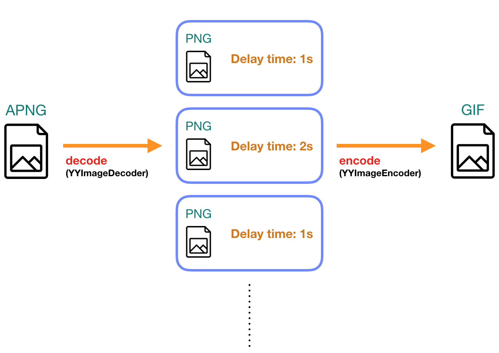
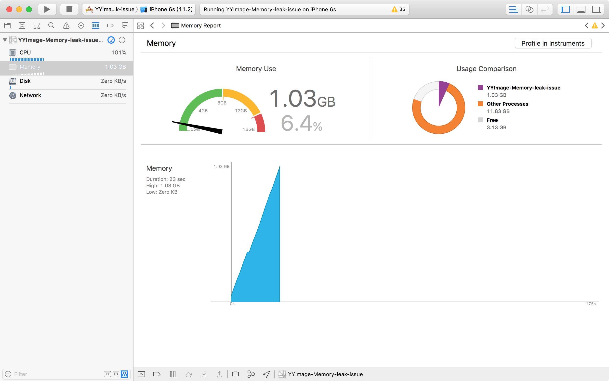
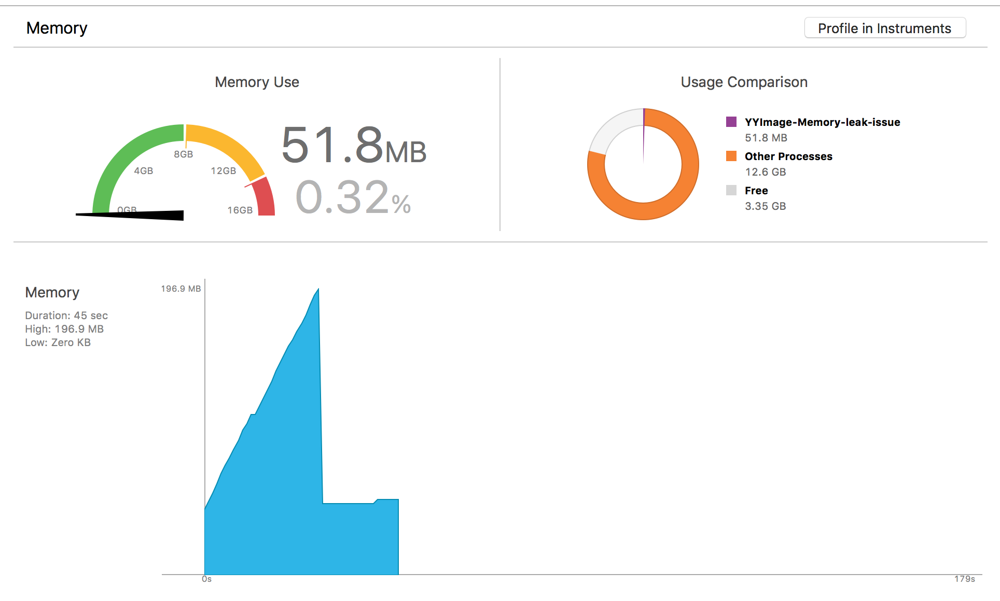
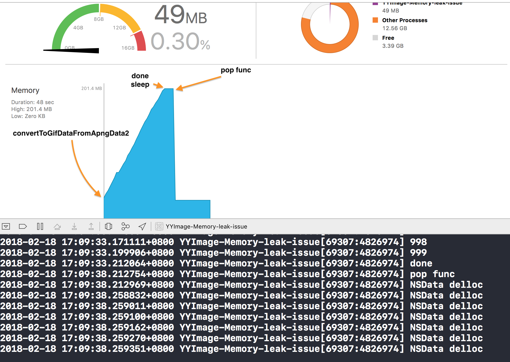
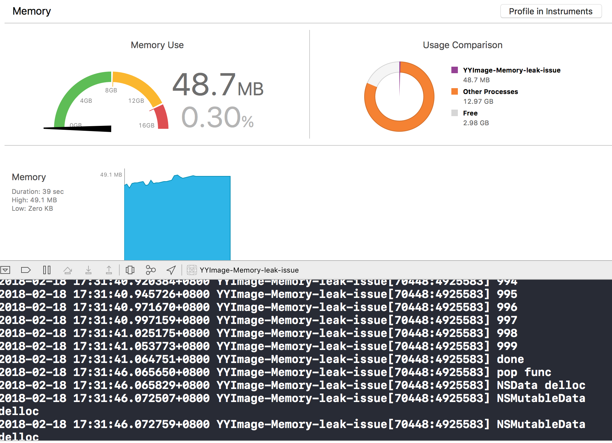
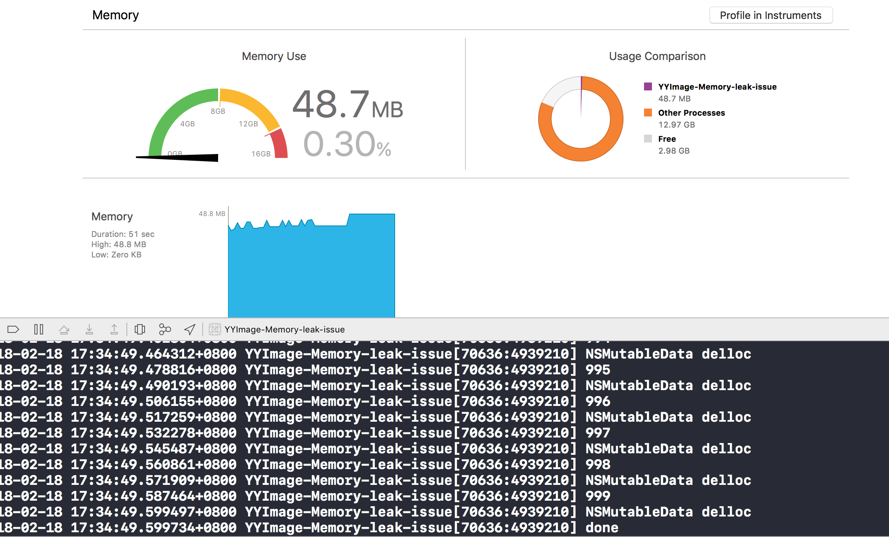

這邊文章主要是在整理在開發過程中，遇到一些記憶體管理的問題，文中會從發現問題，怎麼找問題，以及如何解決來探討。

## 需求
將 `APNG` 格式的圖片轉到 `GIF` 格式的圖片，   

## 流程
使用 [YYImage](https://github.com/ibireme/YYImage) 可以達到這件事，   



1. 用 `YYImageDecoder` 來 decode 圖片，會得到 UIImage array，和 NSTimeInterval array。     
2. 用 `YYImageEncoder` 來 encode 圖片。

## 問題 - 記憶體飆升 
在跑很多張圖片的時候，發現 memory 會持續升高：


跑完的時候，記憶體才降下來：


其中使用到的程式如下：


```objective-c
- (void)viewDidLoad {
    [super viewDidLoad];
    NSString *path = [[NSBundle mainBundle] pathForResource:@"1" ofType:@"png"];
    NSData *apngData = [[NSData alloc] initWithContentsOfFile:path];
    
    [self convertToGifDataFromApngData1:apngData];
}

- (void)convertToGifDataFromApngData1:(NSData *)data {
    for (NSUInteger i = 0; i < 1000; i++) {
        NSMutableArray *frameImages = [NSMutableArray array];
        NSMutableArray *frameTimeIntervals = [NSMutableArray array];
        
        [self setFrameImages:frameImages
              frameTimeIntervals:frameTimeIntervals
                        fromData:data];
        NSLog(@"%ld",i);
        NSData *gifData = [self gifDataWithFrameImages:frameImages frameTimeIntervals:frameTimeIntervals];
    }
}


- (void)setFrameImages:(NSMutableArray <UIImage *>*)frameImages
    frameTimeIntervals:(NSMutableArray <NSNumber *>*)frameTimeIntervals
              fromData:(NSData *)data {
    YYImageDecoder *decoder = [YYImageDecoder decoderWithData:data scale:1.0];
    
    for (NSUInteger i = 0 ; i < decoder.frameCount ; i++ ) {
        YYImageFrame *imageFrame = [decoder frameAtIndex:i decodeForDisplay:YES];
        UIImage *image = imageFrame.image;
        NSTimeInterval duration = imageFrame.duration;
        
        [frameImages addObject:image];
        [frameTimeIntervals addObject:@(duration)];
    }
    
}

- (NSData *)gifDataWithFrameImages:(NSMutableArray *)frameImages frameTimeIntervals:(NSMutableArray *)frameTimeIntervals {
    YYImageEncoder *gifEncoder = [[YYImageEncoder alloc] initWithType:YYImageTypeGIF];
    gifEncoder.loopCount = 0;
    
    for (NSUInteger i = 0 ; i < frameImages.count ; i++ )
    {
        [gifEncoder addImage:frameImages[i] duration:[frameTimeIntervals[i] doubleValue]];
    }
    
    NSData *gifData = [gifEncoder encode];
    return gifData;
}
```

## 找問題
其中發現   
`NSData *gifData = [self gifDataWithFrameImages:frameImages frameTimeIntervals:frameTimeIntervals];`

是讓記憶體飆高的關鍵，因為註解掉就沒事了，   
於是 trace YYImageEncoder 裡面的程式，看看是如何 *將多張圖片組合成一張 GIF* 的，總共會經過 [YYImageCoder](https://github.com/ibireme/YYImage/blob/master/YYImage/YYImageCoder.m) 裡面的三個關鍵 function


1. `YYImageCoder::encode()` -> 
2. `YYImageCoder::_encodeWithImageIO()` ->
3. `YYImageCoder::_encodeImageWithDestination()` 

為了釐清問題，我把有用到的程式獨立成一個 function：


```objective-c
- (NSMutableData *)_encodeWithImageIO:(NSArray <UIImage *>*)_images
                        timeIntervals:(NSArray <NSNumber *>*)_durations {
    NSMutableData *data = [NSMutableData new];
    NSUInteger count =  _images.count;
    CGImageDestinationRef destination = CGImageDestinationCreateWithData((CFMutableDataRef)data, kUTTypeGIF, count, NULL);
    BOOL suc = NO;
    if (destination) {
        NSDictionary *gifProperty = @{(__bridge id)kCGImagePropertyGIFDictionary:
                                          @{(__bridge id)kCGImagePropertyGIFLoopCount: @0}};
        CGImageDestinationSetProperties(destination, (__bridge CFDictionaryRef)gifProperty);
        for (int i = 0; i < count; i++) {
            @autoreleasepool {
                UIImage *imageSrc = _images[i];
                NSDictionary *frameProperty = NULL;
                frameProperty = @{(__bridge id)kCGImagePropertyGIFDictionary : @{(__bridge id) kCGImagePropertyGIFDelayTime:_durations[i]}};
                
                if ((imageSrc).CGImage)
                    CGImageDestinationAddImage(destination, imageSrc.CGImage, (__bridge CFDictionaryRef)frameProperty);
                // 將圖片加到 gif
            }
        }
        suc = CGImageDestinationFinalize(destination);
        CFRelease(destination);
    }
    if (suc && data.length > 0) {
        return data;
    } else {
        return nil;
    }
}
```


仔細檢查了一下，發現該 release 的都有被 release 掉，再測試一次：

```objective-c
- (void)convertToGifDataFromApngData2:(NSData *)data {
    for (NSUInteger i = 0; i < 1000; i++) {
        NSMutableArray *frameImages = [NSMutableArray array];
        NSMutableArray *frameTimeIntervals = [NSMutableArray array];
        
        [self setFrameImages:frameImages
          frameTimeIntervals:frameTimeIntervals
                    fromData:data];
        NSLog(@"%ld",i);
        NSData *gifData = [self _encodeWithImageIO:frameImages timeIntervals:frameTimeIntervals];
    }
}
```

發現記憶體還是一樣會飆高，看起來不是 `YYImage` 的問題，  
使用 Xcode profile 觀察也沒有 memory leak 的問題，只看到記憶體一直飆高，    
在想應該是這行會一直產生 NSData，等到 function 執行完畢才會釋放。
`NSData *gifData = [self _encodeWithImageIO:frameImages timeIntervals:frameTimeIntervals];`

為了驗證這點，我先透過監聽 `NSData::dealloc` 方法 (使用 [method swizzing](http://nshipster.com/method-swizzling/) 來交換 `NSData::dealloc` 和 `NSData::xxx_dealloc` ) 來得知 NSData 真正被釋放的時機，   
並下一些 log :

`ViewController.m`

```objective-c
- (void)viewDidLoad {
    [super viewDidLoad];
    NSString *path = [[NSBundle mainBundle] pathForResource:@"1" ofType:@"png"];
    NSData *apngData = [[NSData alloc] initWithContentsOfFile:path];
    
    [self convertToGifDataFromApngData2:apngData];

    NSLog(@"done");
    sleep(5);
    NSLog(@"pop func");
}
```

`NSData Category`

```objective-c
- (void)xxx_dealloc {
    NSLog(@"NSData delloc");
    [self xxx_dealloc];
}
```



由圖中可以看到在執行 `convertToGifDataFromApngData2` 裡面的 for 迴圈時，NSData 一直沒有被釋放，直到整個 function 執行完畢時，才開始釋放。

## 解決方法

這邊分享兩個方法，都可以解決問題。

### 只 new 一次物件

```objective-c
- (void)convertToGifDataFromApngData3:(NSData *)data {
    NSMutableData *tempData = [NSMutableData new];
    for (NSUInteger i = 0; i < 1000; i++) {
        tempData.length = 0;
        NSMutableArray *frameImages = [NSMutableArray array];
        NSMutableArray *frameTimeIntervals = [NSMutableArray array];
        
        [self setFrameImages:frameImages
          frameTimeIntervals:frameTimeIntervals
                    fromData:data];
        NSLog(@"%ld",i);
        NSData *gifData = [self _encodeWithImageIO:frameImages timeIntervals:frameTimeIntervals fromData:tempData];
    }
}
```

原本 `NSMutableData` 是在 `_encodeWithImageIO:timeIntervals` 裡面建立，  
現在改由在外面建立，並傳入 `_encodeWithImageIO:timeIntervals:fromData`。  
而在每次解析圖片時，需要執行 `tempData.length = 0` 清空裡面的資料，避免會有兩張圖片同時在一個 `NSMutableData` 物件裡面的錯誤。

記憶體使用量已經改善了 ：



### 在 for 裡面使用 @autoreleasepool


```objective-c
- (void)convertToGifDataFromApngData4:(NSData *)data {
    for (NSUInteger i = 0; i < 1000; i++) {
        @autoreleasepool {
            NSMutableArray *frameImages = [NSMutableArray array];
            NSMutableArray *frameTimeIntervals = [NSMutableArray array];
            
            [self setFrameImages:frameImages
              frameTimeIntervals:frameTimeIntervals
                        fromData:data];
            NSLog(@"%ld",i);
            NSData *gifData = [self _encodeWithImageIO:frameImages timeIntervals:frameTimeIntervals];
        }
    }
}
```


使用 `autoreleasepool` 強制在 for 裡面每次都釋放 裡面的物件。

記憶體使用量同樣也獲得改善了 ：


